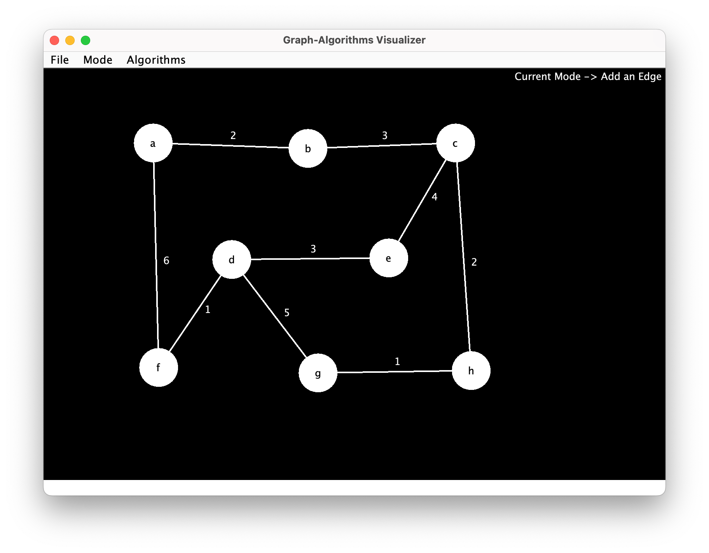

# JetBrains Academy Graph-Algorithms Visualizer Project

An example of a passing solution to the final phase of the JetBrains Academy Java Graph-Algorithms Visualizer project.

## Description

This project is a Swing application that lets the user design graphs with vertices and edges. The application allows the user to add weights to the edges.



The project introduced several algorithms. To scan through all the vertices from a starting vertex, the user can choose to do a Depth-first search or a Breadth-first search. To find the shortest distances to all vertices from a starting vertex, the user can choose Dijkstra's algorithm. Finally, to find a minimum spanning tree from a starting vertex, the user can choose Prim's algorithm.

## Notes

The relative directory structure was kept the same as the one used in my JetBrains Academy solution.

The JetBrains Academy automated testing had trouble reliably clicking on edges between vertices. A workaround was to make the bounds for the JComponent for the edge be only the size of a clickable area for the edge. This made the automated testing happy, but humans can no longer actually see edges on the graph.

IMPORTANT: If you want to see edges show up on the graph, swap which line is commented out in the constructor at the top of the Edge.java file. The files were left in the state they were in to pass the automated tests.

The application can be started with the following command:

```
java visualizer.ApplicationRunner
```

Note that applying the different algorithms produce pretty much instant results. It was necessary to add a pause after algorithm selection to make the testing robot happy.

The logger in the ApplicationRunner.java file is not being used, but I left the reference there because it was handy to have around to do logging while debugging. I used a line like the following to log:

    ApplicationRunner.logger.log(System.Logger.Level.INFO, vertexAdjacencyList);
